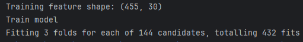
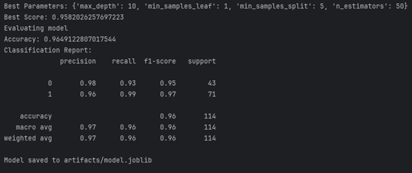
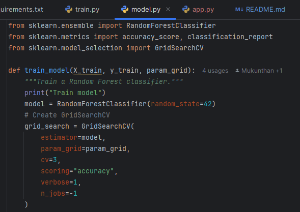
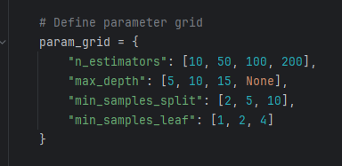
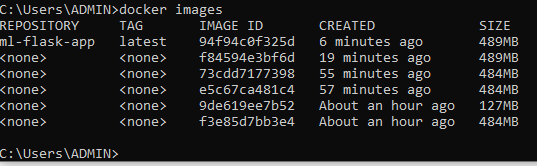
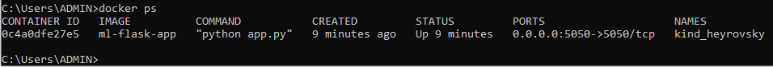
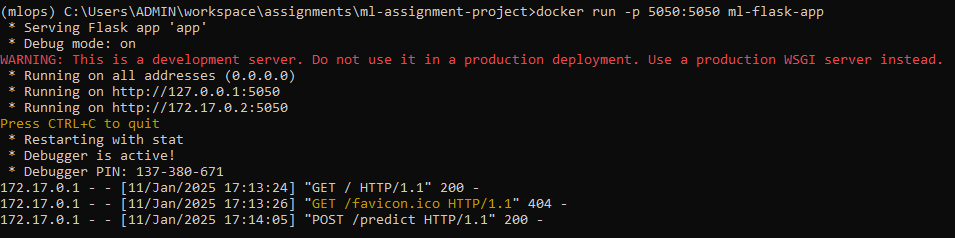
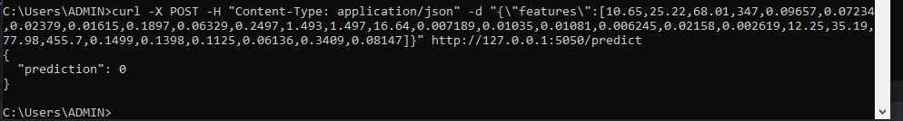
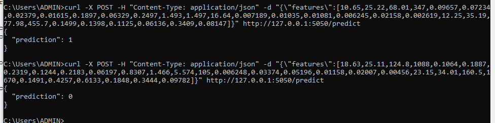

### API test commands:
curl -X POST -H "Content-Type: application/json" -d "{\"features\":[18.63,25.11,124.8,1088,0.1064,0.1887,0.2319,0.1244,0.2183,0.06197,0.8307,1.466,5.574,105,0.006248,0.03374,0.05196,0.01158,0.02007,0.00456,23.15,34.01,160.5,1670,0.1491,0.4257,0.6133,0.1848,0.3444,0.09782]}" http://127.0.0.1:5050/predict
curl -X POST -H "Content-Type: application/json" -d "{\"features\":[10.65,25.22,68.01,347,0.09657,0.07234,0.02379,0.01615,0.1897,0.06329,0.2497,1.493,1.497,16.64,0.007189,0.01035,0.01081,0.006245,0.02158,0.002619,12.25,35.19,77.98,455.7,0.1499,0.1398,0.1125,0.06136,0.3409,0.08147]}" http://127.0.0.1:5050/predict

### Docker commands:
docker build -t ml-flask-app .
docker run -p 5050:5050 ml-flask-app
docker run -it ml-flask-app /bin/bash

# ml-assignment-project
A simple ML project with a CI/CD pipeline.

# Hyperparameter tuning and choosing best performing parameters

# Code for hyperparameter tuning using **GridSearchCV**

### Hyperparameters passed

# Docker image building and running steps:

docker build -t ml-flask-app .
docker run -p 5050:5050 ml-flask-app

### Docker image

### Docker container running flask api

### Docker run command running flask api for model serving

### API response for requested features

