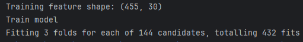
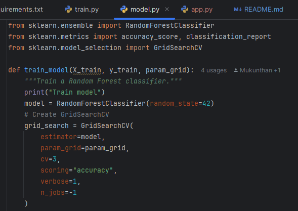

# ml-assignment-project
A simple ML project with a CI/CD pipeline.

# Hyperparameter tuning and choosing best performing parameters

# Code for hyperparameter tuning using **GridSearchCV**

### Hyperparameters passed

# Docker image building and running steps:

docker build -t ml-flask-app .
docker run -p 5050:5050 ml-flask-app

### Docker image

### Docker container running flask api

### Docker run command running flask api for model serving

### API response for requested features

